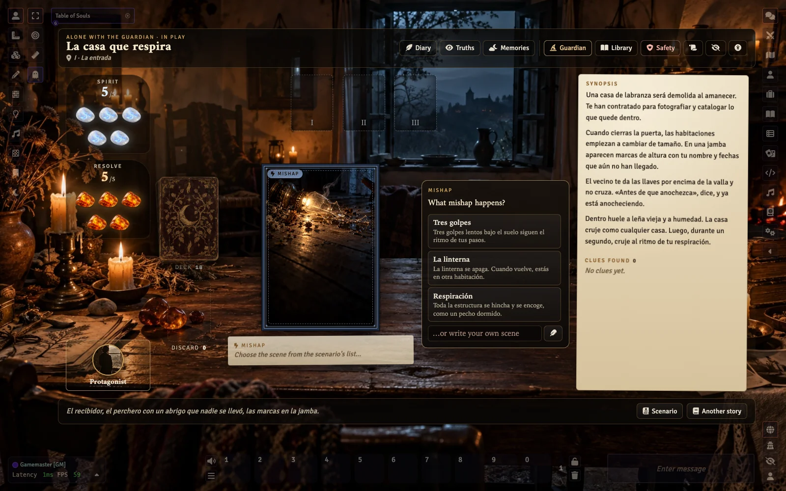
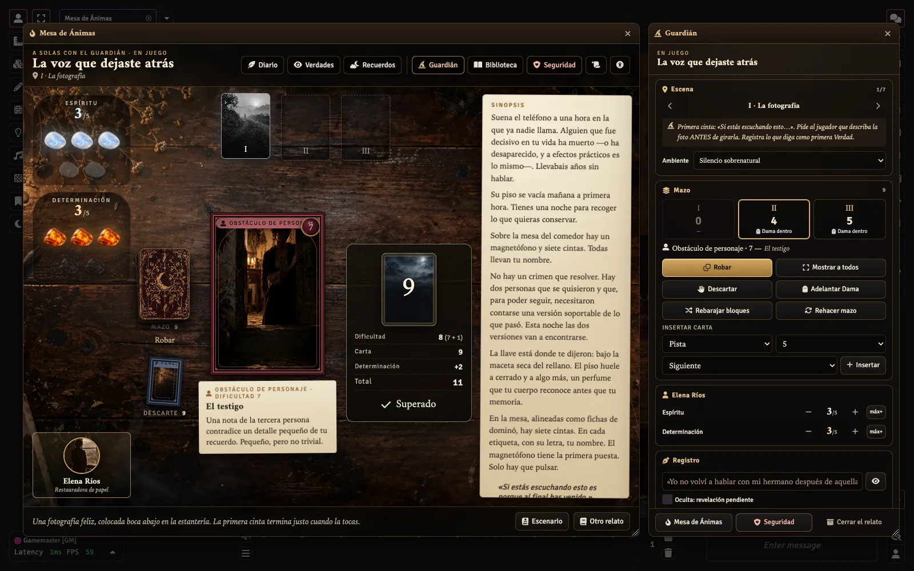
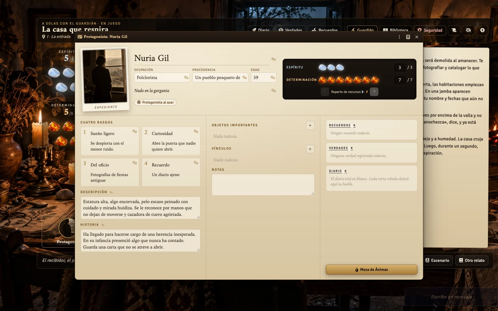
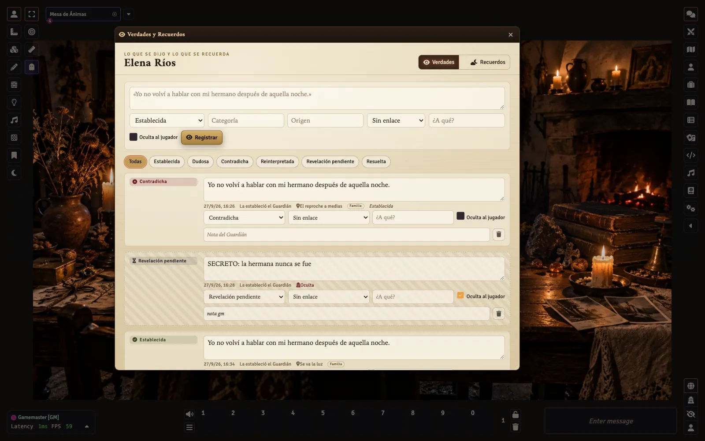
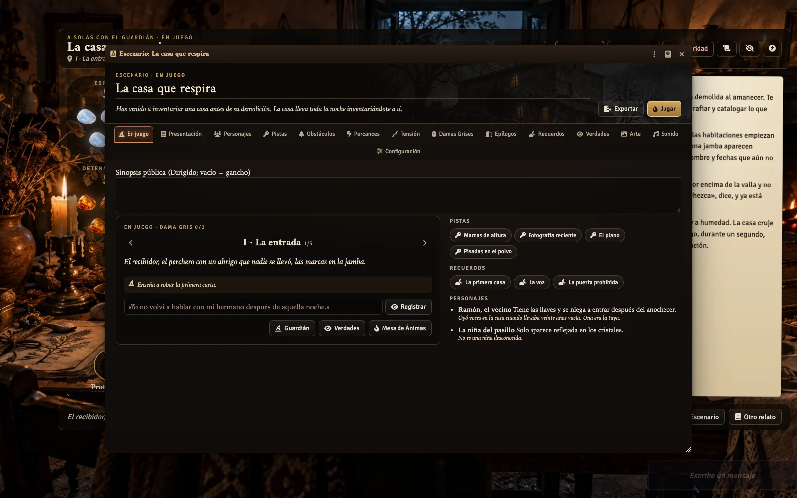

<p align="center">
  
</p>

<h1 align="center">MR · Cuentos de Ánimas</h1>

<p align="center">
  <b>Una caja de relatos malditos encontrada en una vieja casa rural, convertida en sistema para Foundry VTT 13 y 14.</b><br>
  Cartas que se giran sobre madera · piedras frías de Espíritu · ámbar de Determinación · tres Damas Grises · un modo íntimo 1 + 1
</p>

<p align="center">
  <a href="https://github.com/ManuRomera/mr-cuentos-de-animas/releases/latest"></a>
  <a href="https://foundryvtt.com"></a>
  <a href="https://github.com/ManuRomera/mr-cuentos-de-animas/releases"></a>
  
  <a href="LICENSE"></a>
</p>

> Sistema **no oficial** de *Cuentos de ánimas* (Scott Malthouse · El Refugio de Ryhope). No incluye el texto del libro ni sus doce escenarios; sí las cartas, que la propia edición permite reproducir, y 34 escenarios de distribución libre con su autoría. Detalles en [`NOTICE.md`](NOTICE.md).

## Candidata 2.0 · Dirigido

El Director ve y elige las opciones; el narrador recibe solo la escena elegida en una tarjeta privada persistente con whisper nativo. Conserva las decisiones mecánicas, puede pedir un cambio por escena y revela el contenido al terminar o antes si pulsa **Revelar**. La cabina **Ahora** propone narrador, muestra la decisión pendiente y permite texto libre, handouts, reenvíos y gestionar el epílogo por destinatario.

Guardián, Hoguera, Diario y Libre mantienen sus opciones narrativas públicas. Dirigido usa `publicSynopsis` o el gancho como presentación pública y mantiene las notas guardian fuera de la tarjeta del jugador.

**Esta rama prepara 2.0.0; la publicación estable necesita prueba multicliente en Foundry 13 y 14.** Consulta la [guía Dirigido](docs/DIRIGIDO.md) y la [auditoría y aceptación](docs/AUDIT-2.0.md). Los whispers ofrecen la privacidad normal de Foundry, sin cifrado frente a inspección técnica; no borrar el chat que contiene entregas, registros privados y respaldos de permisos. Probar la actualización en una copia del mundo.

**English:** Directed mode gives the GM all narrative options and delivers only the selected scene to the current narrator as a persistent private card and native whisper. The narrator keeps mechanical choices, gets one scene change, and reveals early or on finishing. Normal modes keep public narrative options. See the [guide](docs/DIRIGIDO.md) and [release audit](docs/AUDIT-2.0.md); live v13/v14 acceptance remains required.

## Instalación

En Foundry: **Sistemas de juego → Instalar sistema → URL del manifiesto**

```
https://github.com/ManuRomera/mr-cuentos-de-animas/releases/latest/download/system.json
```

Crea un mundo con **MR · Cuentos de Ánimas**. Al entrar como Guardián aparece un aviso pequeño con los accesos. La Mesa **nunca se abre sola** (salvo que lo actives en los ajustes): está en los controles de escena (icono de luna), en los directorios de Actores y Objetos, en Ajustes y con **Mayús + M**, que también la oculta. Un **tutorial guiado** (Guardián y jugadores) se ofrece la primera vez y se repite desde Configuración.

## Qué hay dentro

| | |
|---|---|
| **Mesa de Ánimas** | Capa a pantalla completa sobre la escena de fondo (que cubre toda la pantalla), sin marco de ventana; se oculta con el ojo y vuelve con una pastilla. Mesa física vista desde arriba: mazo, carta actual, descarte, tres huecos para las Damas Grises, piedras de Espíritu y ámbar de Determinación. La carta sale del mazo, viaja, gira y se asienta. |
| **Cartas** | El mazo del libro sobre documentos *Cards* de Foundry: 4 Pistas, 4 Percances, Obstáculos de Entorno y de Personaje 4‑7 y 3 Damas Grises, en montones de 6, 6 y 4. Dos estilos: **Fotográfico** o **Clásico** (las cartas originales). |
| **Escenas** | Al revelar una carta se elige la escena en la lista del escenario (o se escribe otra) y queda escrita en una hoja bajo la carta. Las pistas halladas quedan a la vista, fuera del descarte. |
| **El relato a la vista** | La Sinopsis, las pistas y la tensión revelada quedan en una columna de la Mesa para releerlas en cualquier momento. |
| **Protagonistas** | Expediente con todo lo que pide el libro y una lista de lo que falta. El reparto de Espíritu y Determinación nunca se sale de las reglas. **Protagonista al azar** con miles de combinaciones y un dado por campo. |
| **Resolución** | Dificultad de la carta +1 por Dama, carta numérica y resultado en la propia mesa, sincronizado. Una Determinación por obstáculo: +2 antes de revelar, o +1 / repetir después. |
| **Damas Grises** | Tres umbrales de tensión: cada una pide su precio, endurece los obstáculos y enfría la mesa (niebla, sombra, desaturación). La tercera abre el epílogo. |
| **Mazo automático** | Tres bloques con una Dama en cada uno: *distribución clásica* o *Damas impredecibles*. El Guardián ve cuántas cartas quedan por bloque y si la Dama sigue dentro, nunca qué carta viene. |
| **A solas con el Guardián** | Verdades (establecida, dudosa, contradicha, reinterpretada, revelación pendiente, resuelta) con origen, autor, enlaces y notas ocultas; recuerdos y preguntas que el Guardián lanza a todos. |
| **Diario y Crónica** | Cada carta, resultado, verdad y epílogo se anota solo; el jugador escribe lo que sintió. Exporta a Markdown y HTML; la crónica estructurada se exporta en JSON. |
| **Escenarios** | Editor completo sin JSON (13 pestañas) y pestaña **En juego** para el Guardián. Biblioteca editorial con filtros, duplicar, variantes, exportar e importar con validación. |
| **Seguridad** | Pausa, Velo y Tarjeta X: inmediatas, sincronizadas y anónimas. |
| **Sonido** | Ambientes sintetizados sin archivos (hoguera, lluvia, viento, casa vieja, bosque, costa, tormenta, cinta magnética, silencio sobrenatural) y microefectos, con volúmenes separados. |
| **Accesibilidad** | Tamaño de texto, alto contraste, tipografía sencilla, espaciado, botones grandes, reducir movimiento (y `prefers-reduced-motion`), reducir efectos, lectura limpia, ayuda contextual. |
| **Mejoras MR** | Memoria de ventanas por usuario y mundo, siempre dentro de la pantalla; ayuda al detenerse sobre un elemento y ficha ampliada con clic derecho; español e inglés. |

## Escenarios

- **Colección incluida: 34 escenarios** de la *Folclore Rol Jam 2022*, los *Escenarios fanmade*, *Cuento de Navidad*, *Desvelos del pasado*, *Grabación en vivo* y *Cima*. Biblioteca → *Colección incluida* → *Añadir y jugar*.
- **Importar los tuyos** (o los del libro, para uso privado): Biblioteca → *Cómo importar* explica el formato exacto y te da un prompt para generarlo con una IA. Guía: [`docs/IMPORTAR.md`](docs/IMPORTAR.md).

### Originales de este sistema

- **La voz que dejaste atrás** · 1 + Guardián · 90–150 min. Un piso que se vacía mañana, un magnetófono y siete cintas con tu nombre. No hay crimen que resolver: hay dos personas que necesitaron contarse una versión soportable de lo que pasó.
- **La casa que respira** · 1–4 jugadores · 45–70 min. Escenario corto para aprender la Mesa: robar, resolver, gastar Determinación, perder Espíritu y ver llegar una Dama Gris.

<p align="center">
  
  
  
  
</p>

## Si algo falla

El arranque va por fases aisladas: si una falla, Foundry sigue funcionando y aparece un aviso. Abre **Ajustes → MR · Cuentos de Ánimas → Diagnóstico** (o ejecuta `game.mrCuentosDeAnimas.diagnostic({ show: true })` en la consola), pulsa **Copiar** y pégalo en una [incidencia](https://github.com/ManuRomera/mr-cuentos-de-animas/issues).

## Arte

El estilo **fotográfico** usa arte creado para el sistema con una biblia de estilo común ([`docs/ARTE.md`](docs/ARTE.md)): luz de vela, niebla, madera y papel. Para sustituir una imagen basta con dejarla en `art-inbox/` con su nombre y ejecutar `python3 scripts/import-art.py`.

## Desarrollo

```bash
npm test        # reglas, estructura, imports, idiomas y seguridad de arranque
npm run check   # sintaxis, JSON y rutas de arte
npm run build   # dist/mr-cuentos-de-animas.zip + dist/system.json
```

- Una sola base de código para Foundry 13 y 14; las diferencias viven en `module/compat.mjs`.
- Reglas puras en `module/rules.mjs` (sin Foundry, probadas en Node). Si tu edición del libro usa otros valores, se cambian ahí.
- Publicar: subir la versión en `system.json`, `package.json` y `CHANGELOG.md`, y empujar la etiqueta `vX.Y.Z`. La acción **Publicar** crea la release con `system.json` y el zip.

## Créditos

- Diseño e implementación para Foundry VTT: **Manu Romera**.
- *Cuentos de Ánimas* pertenece a sus autores y editorial. Foundry Virtual Tabletop es de Foundry Gaming LLC. Este proyecto no está afiliado a ninguno de ellos. Ver [`NOTICE.md`](NOTICE.md).
- Licencia del código: [`LICENSE`](LICENSE).

---

<p align="center">
  <a href="https://github.com/ManuRomera">
    <picture>
      <source media="(prefers-color-scheme: dark)" srcset="https://raw.githubusercontent.com/ManuRomera/ManuRomera/main/brand/MR_09_Monograma_Marfil_Transparente.png">
      
    </picture>
  </a><br>
  <sub>Hecho por <a href="https://github.com/ManuRomera"><b>Manu Romera</b></a> · Digital RPG Design</sub>
</p>
