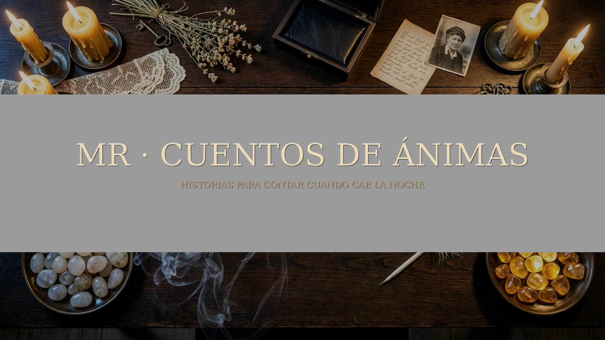

<p align="center">
  
</p>

# MR · Cuentos de Ánimas

**Una mesa digital para relatos de horror íntimo, rural y sobrenatural en Foundry VTT 13/14.**  
Implementación no oficial concebida como una caja ritual: cartas físicas, piedras de Espíritu, ámbar de Determinación, Damas Grises y un diario que conserva la historia que la mesa acaba de inventar.

> Este repositorio no incluye ni reproduce el reglamento, escenarios, cartas ni textos oficiales de *Cuentos de Ánimas*. Para usar material oficial necesitas tu propio ejemplar y cargarlo de forma privada. La versión pública incluye exclusivamente contenido y arte originales del proyecto.


## ✦ Lo que hace diferente a este sistema

- **Mesa de Ánimas** a pantalla amplia: la interfaz principal no parece una ficha de Foundry.
- **Cartas nativas de Foundry como backend**, con presentación propia, animación, reversos y familias visuales originales.
- **Espíritu** como piedras lunares y **Determinación** como fragmentos de ámbar vivo.
- Tres **Damas Grises** con crescendo visual y mecánico.
- Modos **La Hoguera**, **El Diario**, **A solas con el Guardián (1+1)** y **Relato libre**.
- **Verdades y contradicciones** para registrar lo que el protagonista establece durante la ficción y volver contra ello más tarde.
- **Diario automático** de la partida, editable y exportable a Markdown.
- Editor completo para crear escenarios sin tocar código.
- Señales de seguridad integradas: **Pausa, Velo y Tarjeta X**, sin identificar a la persona que las activa.
- Microsonidos sintetizados: no requiere paquetes de audio externos.

## ✦ Mejoras MR incluidas de serie

Las ventanas recuerdan posición, tamaño, pestañas, secciones y desplazamiento por usuario y mundo. La ayuda contextual funciona por **hover prolongado y clic derecho**. Incluye modo de lectura, alto contraste, tipografía simplificada, espaciado ampliado, escala de texto y reducción de movimiento. Todo el sistema está construido sobre **ApplicationV2** y encapsula la compatibilidad entre Foundry v13 y v14.

## ✦ Contenido original incluido

### La voz que dejaste atrás
Una aventura íntima 1+1 de 90–150 minutos. Un apartamento vacío. Siete cintas grabadas. Dos personas que llevan años contándose versiones distintas de la misma despedida.

### La casa que respira
Escenario de demostración de 45–70 minutos pensado para enseñar las mecánicas sin una preparación larga.

## Instalación

Cuando exista una Release estable, pega este manifest en **Instalar sistema → URL del manifiesto**:

```text
https://github.com/ManuRomera/mr-cuentos-de-animas/releases/latest/download/system.json
```

También puedes descargar `mr-cuentos-de-animas.zip` desde Releases y descomprimirlo dentro de `Data/systems/`.

## Desarrollo

```bash
npm test
npm run check
npm run build
```

El build genera:

```text
dist/system.json
dist/mr-cuentos-de-animas.zip
```

## Compatibilidad

- Foundry VTT **v13+**
- Verificado para **v14**
- Sin dependencias obligatorias de módulos externos

## Autoría

Implementación, dirección de producto y diseño: **Manu Romera**.  
Desarrollo y diseño asistidos con **OpenAI**.  
Proyecto independiente y no oficial. Consulta [NOTICE.md](NOTICE.md).

---

<p align="center"><em>Hay historias que solo aceptan ser contadas cuando cae la noche.</em></p>
